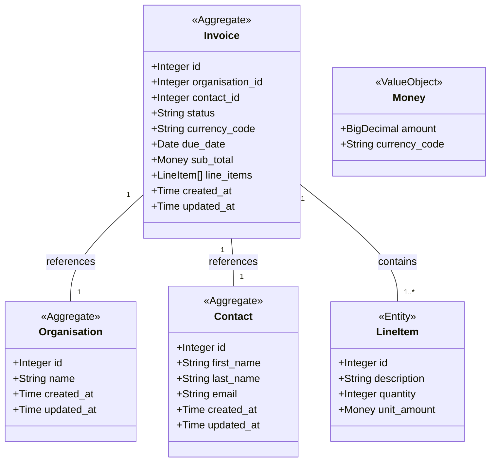

# Model

```mermaid
classDiagram
    class Invoice {
        +Integer id
        +Integer organisation_id
        +Integer contact_id
        +String status
        +String currency_code
        +Date due_date
        +Money sub_total
        +LineItem[] line_items
        +Time created_at
        +Time updated_at
        <<Aggregate>>
    }
    class Organisation {
        +Integer id
        +String name
        +Time created_at
        +Time updated_at
        <<Aggregate>>
    }
    class Contact {
        +Integer id
        +String first_name
        +String last_name
        +String email
        +Time created_at
        +Time updated_at
        <<Aggregate>>
    }
    class Money {
        +BigDecimal amount
        +String currency_code
        <<ValueObject>>
    }
    class LineItem {
        +Integer id
        +String description
        +Integer quantity
        +Money unit_amount
        <<Entity>>
    }

    Invoice "1" -- "1" Organisation : references
    Invoice "1" -- "1" Contact : references
    Invoice "1" -- "1..*" LineItem : contains
```
