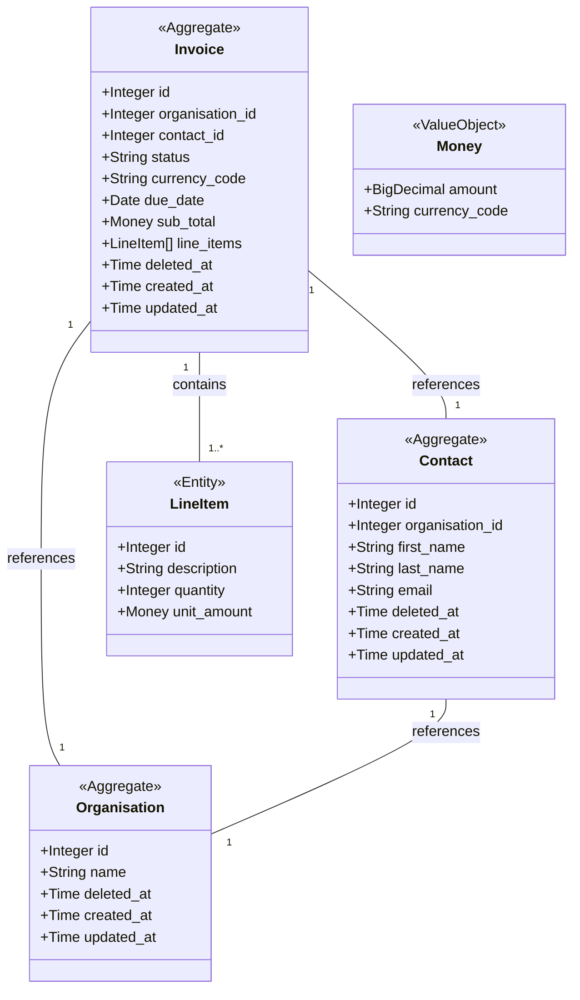

# Behaviour

https://www.notion.so/how-to-describe-behaviour-1bea4df2eb114f76a659b3aa8b5336d5#164ec8080b9e420a8036d2f964f52fa1

# Model



# API

## Organisation

### Create

```
curl -X POST http://localhost:3000/accountify/organisation \
     -H "Content-Type: application/json" \
     -H "Authorization: Bearer YOUR_ACCESS_TOKEN" \
     -H "X-Iam-Tenant-id: 1" \
     -d '{"name": "New Organisation"}'
```

### Read

```
curl -X GET http://localhost:3000/accountify/organisation/1 \
     -H "Authorization: Bearer YOUR_ACCESS_TOKEN" \
     -H "X-Iam-Tenant-id: 1"
```

### Update

```
curl -X PUT http://localhost:3000/accountify/organisation/1 \
     -H "Content-Type: application/json" \
     -H "Authorization: Bearer YOUR_ACCESS_TOKEN" \
     -H "X-Iam-Tenant-id: 1" \
     -d '{"name": "Updated Organisation Name"}'
```

### Delete

```
curl -X DELETE http://localhost:3000/accountify/organisation/1 \
     -H "Authorization: Bearer YOUR_ACCESS_TOKEN" \
     -H "X-Iam-Tenant-id: 1"
```


## Contact

### Create

```
curl -X POST http://localhost:3000/accountify/contact \
     -H "Content-Type: application/json" \
     -H "Authorization: Bearer YOUR_ACCESS_TOKEN" \
     -H "X-Iam-Tenant-id: 1" \
     -d '{
           "organisation_id": 2,
           "first_name": "John",
           "last_name": "Doe",
           "email": "john.doe@example.com"
         }'
```

### Read

```
curl -X GET http://localhost:3000/accountify/contact/1 \
     -H "Authorization: Bearer YOUR_ACCESS_TOKEN" \
     -H "X-Iam-Tenant-id: 1"
```

### Update

```
curl -X PUT http://localhost:3000/accountify/contact/3 \
     -H "Content-Type: application/json" \
     -H "Authorization: Bearer YOUR_ACCESS_TOKEN" \
     -H "X-Iam-Tenant-id: 1" \
     -d '{
           "first_name": "Jane",
           "last_name": "Doe",
           "email": "jane.doe@example.com"
         }'
```

### Delete

```
curl -X DELETE http://localhost:3000/accountify/contact/3 \
     -H "Authorization: Bearer YOUR_ACCESS_TOKEN" \
     -H "X-Iam-Tenant-id: 1"
```


## Invoice

### Create

```
curl -X POST http://localhost:3000/accountify/invoice \
     -H "Content-Type: application/json" \
     -H "Authorization: Bearer YOUR_ACCESS_TOKEN" \
     -H "X-Iam-Tenant-id: 1" \
     -d '{
           "organisation_id": 2,
           "contact_id": 3,
           "currency_code": "AUD",
           "due_date": "2024-12-31",
           "line_items": [
             {
               "description": "Service Fee",
               "unit_amount": {"amount": 200, "currency_code": "AUD"},
               "quantity": 3
             },
             {
               "description": "Maintenance Fee",
               "unit_amount": {"amount": 150, "currency_code": "AUD"},
               "quantity": 5
             }
           ]
         }'
```

### Read

```
curl -X GET http://localhost:3000/accountify/invoice/1 \
     -H "Authorization: Bearer YOUR_ACCESS_TOKEN" \
     -H "X-Iam-Tenant-id: 1"
```

### Update

```
curl -X PUT http://localhost:3000/accountify/invoice/1 \
     -H "Content-Type: application/json" \
     -H "Authorization: Bearer YOUR_ACCESS_TOKEN" \
     -H "X-Iam-Tenant-id: 1" \
     -d '{
           "organisation_id": 2,
           "contact_id": 3,
           "due_date": "2025-01-31",  // New due date
           "line_items": [
             {
               "description": "Service Fee",
               "unit_amount": {"amount": 210, "currency_code": "AUD"},
               "quantity": 2  // Updated quantity
             },
             {
               "description": "Maintenance Fee",
               "unit_amount": {"amount": 150, "currency_code": "AUD"},
               "quantity": 4  // Updated quantity
             }
           ]
         }'

```

### Approve

```
curl -X PATCH http://localhost:3000/accountify/invoice/1/approve \
     -H "Authorization: Bearer YOUR_ACCESS_TOKEN" \
     -H "X-Iam-Tenant-id: 1"
```

### Void

```
curl -X PATCH http://localhost:3000/accountify/invoice/1/void \
     -H "Authorization: Bearer YOUR_ACCESS_TOKEN" \
     -H "X-Iam-Tenant-id: 1"
```

### Delete

```
curl -X DELETE http://localhost:3000/accountify/invoice/1 \
     -H "Authorization: Bearer YOUR_ACCESS_TOKEN" \
     -H "X-Iam-Tenant-id: 1"
```
